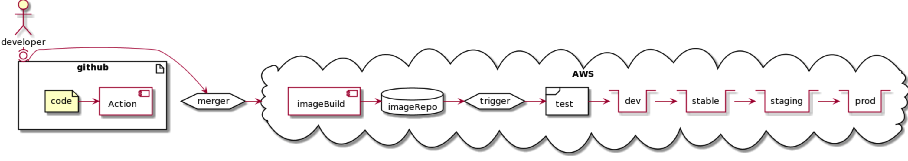

# Overview of CI/CD for startup
**Chen Xi**
**hixichen@github**

##CI

- Jenkins requires SRE team. Never a option for small startup.

- Circle CI: ios/osx support, API integrated with AWS code deploy, ssh debug, docker support.

- Github action: fully integrated with github, easy, free to small team.

- Tekton: pipeline on k8s, nice future, under developing, requires ops work.

###Github Action

- Mainly used for unit test: build & test

**Note:**

- Requires git permission to other private repos.
- Secrets are shared for org, requires better RBAC model.


##CD

**Requirements:**

- Fully automated
- Can be triggered by event and manual
- Multiple steps for one stage: test,deploy and verify
- Multiple stages: dev, stable, staging(canary), production
- One config for all stage with env update only.
- Block/Approve model between stages

###Why AWS code pipeline:

- Source: S3/Github public/private repo
- Build: aws codebuild
- mage: aws ECR
- Trigger: ecr new image or manual release
- Test: directly run or apply yaml for test
- Deployment: read yamls from source code
- Detect: check health via curl or yaml Job


### CD for kubernetes:

* [kustomize](https://kustomize.io/) - Dynamic configurations in Kubernetes, Built in `kubectl -k` now!

```
~/myapp
├── base
│   ├── deployment.yaml
│   ├── kustomization.yaml
│   └── service.yaml
└── overlays
    ├── test
    │   ├── dev.yaml
    │   ├── integration.yaml
    │   └── stress.yaml
    ├── development
    │   ├── cpu_count.yaml
    │   ├── kustomization.yaml
    │   └── replica_count.yaml
    └── production
        ├── cpu_count.yaml
        ├── kustomization.yaml
        └── replica_count.yaml
```


##Overview:




### stage: dev
1. build image
1. publish imagae
1. apply
	- kubectl apply -k config/{ENVIRONMENT}
1. use local deploy DB for test

### stage: stable
1. apply
1. run integration test
1. use single instance DB on AWS for test only.

### stage: staging
1. apply
1. run integration test, perf test
1. use multiple instance DB with backup on AWS.
1. Try to simulate production env as much as you can.

### stage: production
1. release with shadown
1. require manul approved process for pipeline.


  
  
