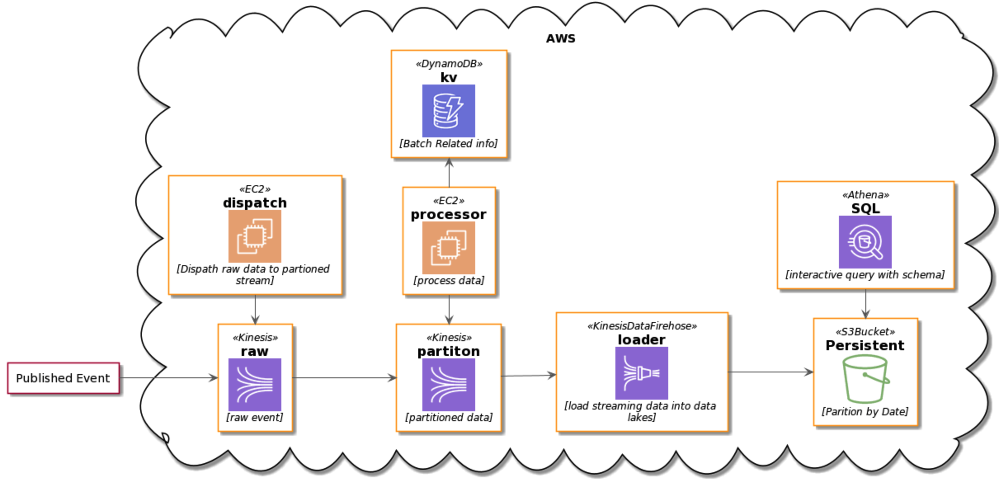

# Event-Driven Application Design

**Chen Xi**

**hixichen@github**

## why event driven?

- Better scalability.
- Increased versatility

### Event Stream Processing

###Amazon Kinesis: 

makes it easy to collect, process, and analyze real-time, streaming data.

Kinesis Limits:

- Kinesis maximum size of a request data blob: 1MB.
- The default shard quota is 500 shards per stream. can be scale to 5,000 shards.

Per Shared:

- GetRecords: 5 TPS,  The maximum number of records that can be returned per call is 10,000. 
- PutRecord: 1000 TPS, Each shard can support writes up to 1,000 records per second
- PutRecords: Each PutRecords request can support up to 500 records. Each record in the request can be as large as 1 MB, up to a limit of 5 MB for the entire request, including partition keys. Each shard can support writes up to 1,000 records per second, up to a maximum data write total of 1 MB per second.

###Apache Kafka: 
 an open-source stream-processing software platform 

##Sample App

Maximum:

- Read per stream: 5000(shareds) * 5TPS * 10000records
- Write per stream: 5000(shareds) * 1000TPS * 1000records

### Challenges:
- Client complexity: 
   - Enumerates the shards
   - Coordinates shards with other workers
   - Checkpoint for processed record.
   - Write at lease one.
- Amazon Kinesis Firehose to S3 with Protobuf data
   - if S3 data will be used for query, need lambda to process data.
   - a customer who implemented firehose in produciton before realising [this](https://github.com/awslabs/amazon-kinesis-agent/issues/57), and getting bill shock. 

- Duplicate Records

- TimeStamp:  process time, sent time, receive time.

  Around 5 seconds gap here, if you query data at S3 partitions with 1 day window, you may read data that belongs to tomorrow, but miss data records lived in yesterday's partition. 